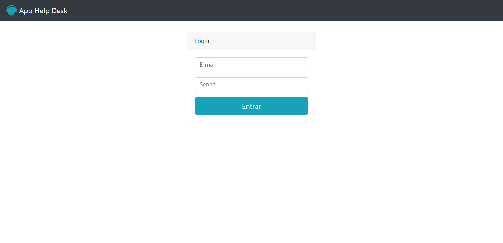

# App Help Desk
Projeto criado através da plataforma Udemy no curso Desenvolvimento Web Completo.

## Tecnologias utilizadas

+ HTML5
+ CSS3
+ Bootstrap
+ PHP

## Estrutura do site

+ Tela de login: Página inicial da aplicação.
+ Home: Seção onde é possível criar ou consultar um chamado.
+ Tela de criação de chamado: Seção onde é possível criar os chamados.
+ Tela de consulta do chamado: Seção onde é possível consultar os chamados criados.

## Tela Inicial

